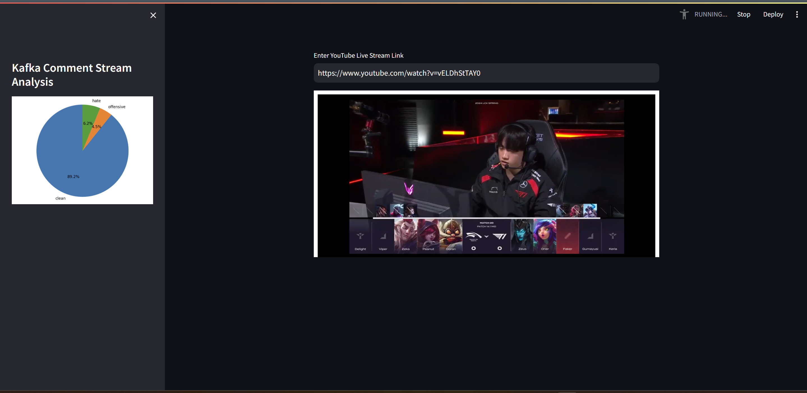

# Youtube-kafka-HateSpeech

This project will extract live comments from a youtube livestream and using a Vietnamese hatespeech detection model to predict the label for a comment

## Getting Started

To run this project, you will need to have docker installed. 

To start the docker containers
```sh
docker compose up 

```

Exec the kafka containers and run these command 
```sh
cd opt/bitnami/kafka
# Start zookeeper 
sh bin/zookeeper-server-start.sh config/zookeeper.properties 
# Start kafka server 
sh bin/kafka-server-start.sh config/server.properties.original 
```

Start the producer by running 
```python
python producer.py 
```

Start the consumer by running 
```python
python -m kafka_service.consumer
```


Start the streamlit app  
```python
streamlit run app.py
```





## References
https://github.com/sonlam1102/vihsd.git